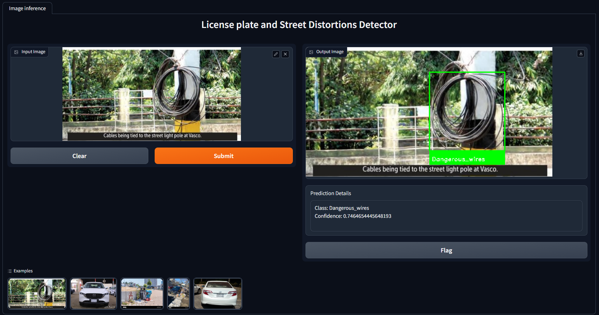
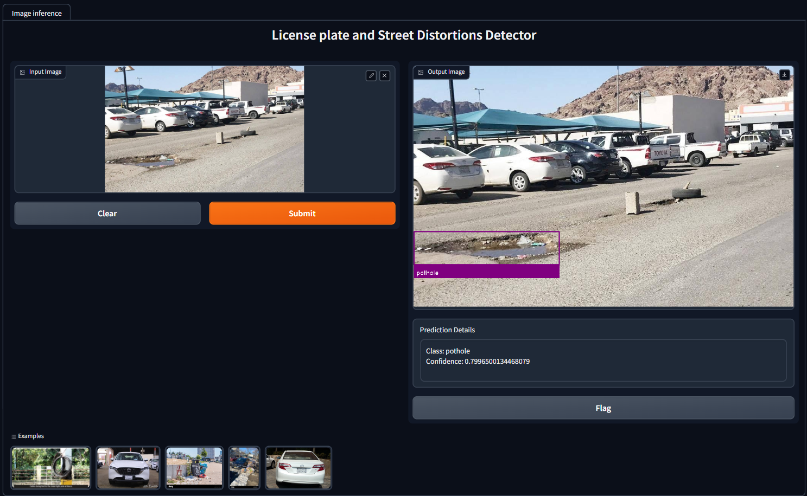
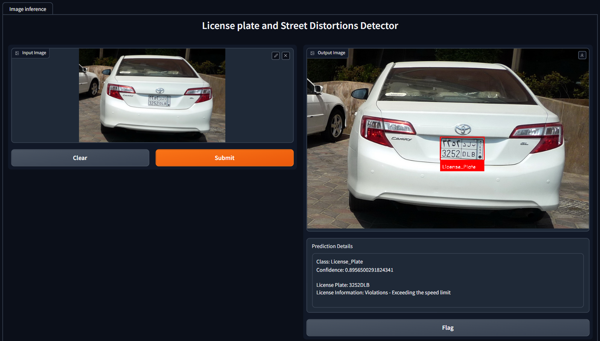

# License Plates and Street Distortions Detection

## About The Project

The purpose of the repo is to develop a web app for the detection of violations license car plates and street distortions. By leveraging advanced computer vision models, the goal is to provide a robust and user-friendly web page that assists in predicting and recognizing illegal activities related to license plates and street distortions. 

## Best Results
This repository contains a Python project that uses YOLOv8, Roboflow and OpenCV. Ultralytics YOLOv8 is the latest version of the YOLO (You Only Look Once) object detection and image segmentation model developed by Ultralytics. The YOLOv8 model is designed to be fast, accurate, and easy to use, making it an excellent choice for a wide range of object detection and image segmentation tasks.

With object detection capabilities, the application identifies and categorizes various objects from color images, focusing on five critical use cases:
- Potholes
- Dangerous wires
- Wall graffiti
- Garbage.
- License plates violations

## Applying OCR to The License Plate
To apply OCR on a License plate text detection and recognition, I use a module called [keras-ocr](https://keras-ocr.readthedocs.io/en/latest/). 

## Dataset
To create the model's dataset, all bellow labeled datasets were cloned at ones to use for the same task. Each class has approximately between 1,000 to 1,800 images, a total of 8,310 images.
All datasets are ready labeled with bounding box annotation, COCO, PASCAL VOC and YOLO formats, powered by [Roboflow Universe](https://universe.roboflow.com/).

- Potholes:
  - [Pothole Image Dataset](https://universe.roboflow.com/belajar-y9rv6/pothole-projet/dataset/4)
  - [Potholes Detection Dataset](https://universe.roboflow.com/latifa-aloufi-cfd5y/potholes-detection740)

- Dangerous wires:
  - [Damaged Light Poles Dataset](https://universe.roboflow.com/umut/27agu/browse?queryText=class%3Akapakyok&pageSize=200&startingIndex=400&browseQuery=true)
  - [Damaged Electrical Boxes](https://universe.roboflow.com/xtu-zylqw/dsadsadsadas)

- Wall graffiti:
  - [Graffiti Dataset 1](https://universe.roboflow.com/feda/my-dataset-uda6e/dataset/1)
  - [Graffiti Dataset 2](https://universe.roboflow.com/workspace-2-iz9jz/graffiti-5sa0t)

- Garbage:
  - [Garbage Detection Image Dataset](https://universe.roboflow.com/universidad-carlos-iii-de-madrid-i1yfs/final-garbage-detection/dataset/1)
  - [Garbage Dataset](https://universe.roboflow.com/universidad-carlos-iii-de-madrid-i1yfs/4-better-garbage-detection)

- License plates violations
  - [Saudi Licence Plates Dataset 1](https://universe.roboflow.com/nawaf-barboud/saudi-plates)
  - [Saudi Licence Plates Dataset 2](https://universe.roboflow.com/elm/lpr-2eg4q)
  - [Saudi Licence Plates Dataset 3](https://universe.roboflow.com/scpm/scpm-ngswi)
 

## Demo
The best performing model can be used by running the demo app that created with [Gradio](https://www.gradio.app/).

